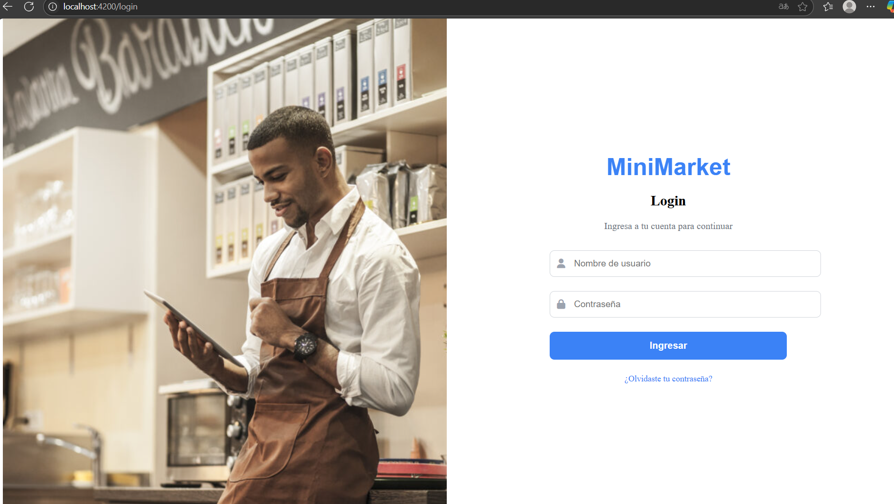
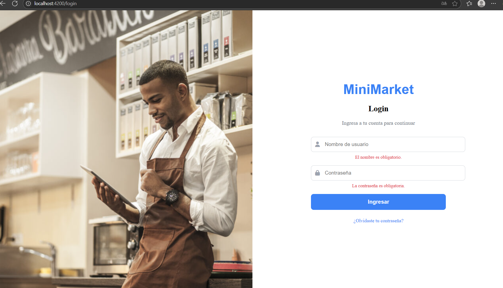

# MiniTiendaFS 🛒 (En desarrollo)

Proyecto Full Stack en desarrollo usando **Angular** (frontend) y **Flask** (backend) con autenticación JWT.

## 🧪 Simulación de mini tienda online con:

- 🧑‍💻 Login con validación y tokens JWT
- 🔐 Protección de rutas en Angular (`authGuard`)
- 🔄 Comunicación Angular ↔️ Flask con arquitectura limpia (servicios, repositorios, interfaces)
- 🛍️ Gestión de productos (CRUD)

## ✅ Avances actuales

- Login funcionando con diseño moderno y validaciones
- Token guardado en `localStorage` tras login exitoso
- Rutas protegidas en Angular según autenticación
- Backend Flask con rutas `/auth/register` y `/auth/login` + CRUD básico de usuarios
- 🧰 Configuración de `HttpClientService` personalizado para manejar headers y tokens
- 🌐 `ApiService` centralizado para gestionar todas las solicitudes HTTP

## 🖼️ Capturas

---

> Proyecto en curso como práctica intensiva de desarrollo Full Stack (Angular + Flask).
